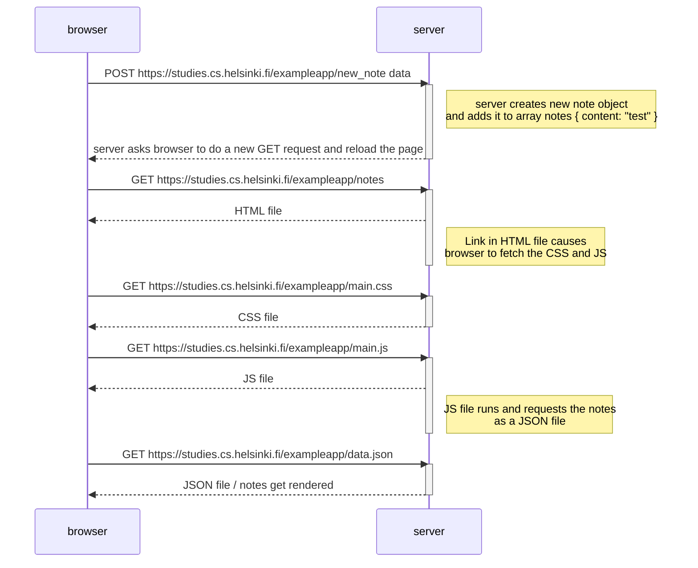

```mermaid

sequenceDiagram
    participant browser
    participant server

    browser->>server: POST https://studies.cs.helsinki.fi/exampleapp/new_note data
    activate server
    note right of server: server creates new note object <br>and adds it to array notes { content: "test" }
    server-->>browser: server asks browser to do a new GET request and reload the page
    deactivate server

    browser->>server: GET https://studies.cs.helsinki.fi/exampleapp/notes
    activate server
    server-->>browser:  HTML file
    note right of server: Link in HTML file causes <br> browser to fetch the CSS and JS
    deactivate server

    browser->>server: GET https://studies.cs.helsinki.fi/exampleapp/main.css
    activate server
    server-->>browser:  CSS file
    deactivate server

    browser->>server: GET https://studies.cs.helsinki.fi/exampleapp/main.js
    activate server
    server-->>browser:  JS file
    note right of server: JS file runs and requests the notes<br> as a JSON file
    deactivate server

    browser->>server: GET https://studies.cs.helsinki.fi/exampleapp/data.json
    activate server
    server-->>browser:  JSON file / notes get rendered
    deactivate server

```
