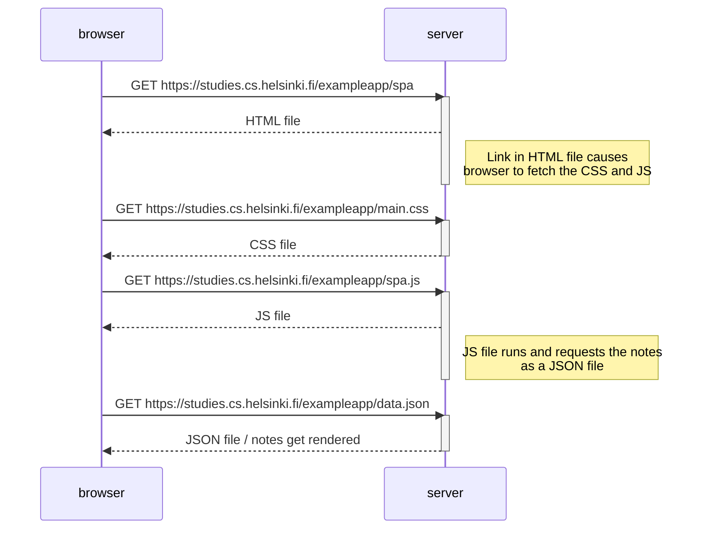

```mermaid
%% Almost the same as exercise 4 considering no notes are added. Only difference are the links. 
sequenceDiagram
    participant browser
    participant server

    browser->>server: GET https://studies.cs.helsinki.fi/exampleapp/spa
    activate server
    server-->>browser:  HTML file
    note right of server: Link in HTML file causes <br> browser to fetch the CSS and JS
    deactivate server

    browser->>server: GET https://studies.cs.helsinki.fi/exampleapp/main.css
    activate server
    server-->>browser:  CSS file
    deactivate server

    browser->>server: GET https://studies.cs.helsinki.fi/exampleapp/spa.js
    activate server
    server-->>browser:  JS file
    note right of server: JS file runs and requests the notes<br> as a JSON file
    deactivate server

    browser->>server: GET https://studies.cs.helsinki.fi/exampleapp/data.json
    activate server
    server-->>browser:  JSON file / notes get rendered
    deactivate server

```

