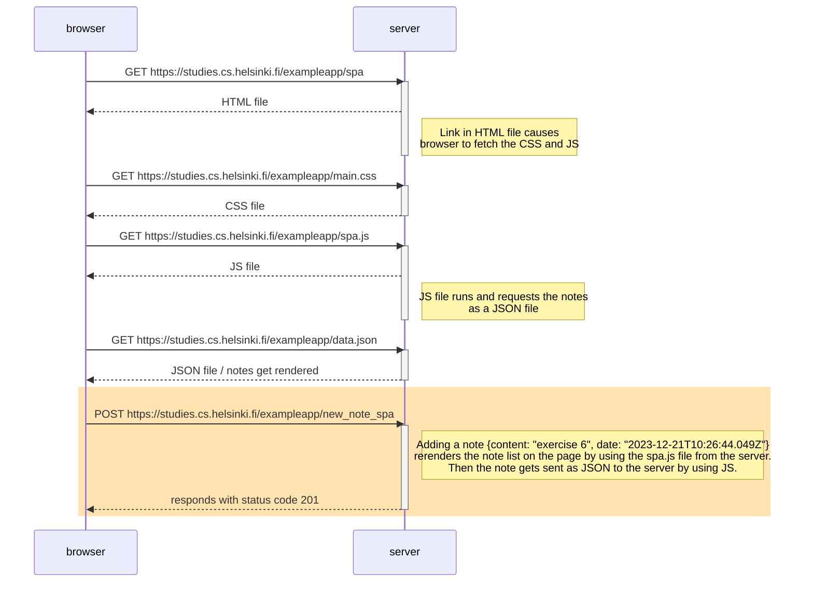

```mermaid

%% The power of SPA's are clear. Interesting to see the difference between exercise 4 and 6.
%% I added the previous steps of exercise 5 to make the difference between exercise 4 and 6 obvious.
%% I used a background color to make it clear what happened in exercise 6.

sequenceDiagram
    participant browser
    participant server

    browser->>server: GET https://studies.cs.helsinki.fi/exampleapp/spa
    activate server
    server-->>browser:  HTML file
    note right of server: Link in HTML file causes <br> browser to fetch the CSS and JS
    deactivate server

    browser->>server: GET https://studies.cs.helsinki.fi/exampleapp/main.css
    activate server
    server-->>browser:  CSS file
    deactivate server

    browser->>server: GET https://studies.cs.helsinki.fi/exampleapp/spa.js
    activate server
    server-->>browser:  JS file
    note right of server: JS file runs and requests the notes<br> as a JSON file
    deactivate server

    browser->>server: GET https://studies.cs.helsinki.fi/exampleapp/data.json
    activate server
    server-->>browser:  JSON file / notes get rendered
    deactivate server

    
    rect rgba(255, 165, 0, 0.3)
    browser->>server: POST https://studies.cs.helsinki.fi/exampleapp/new_note_spa
    activate server
    note right of server: Adding a note {content: "exercise 6", date: "2023-12-21T10:26:44.049Z"} <br> rerenders the note list on the page by using the spa.js file from the server. <br>        Then the note gets sent as JSON to the server by using JS.
    server-->>browser:  responds with status code 201
    deactivate server
    end

```

